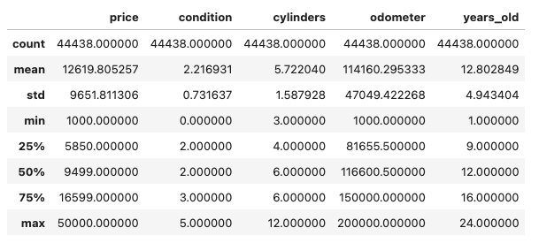
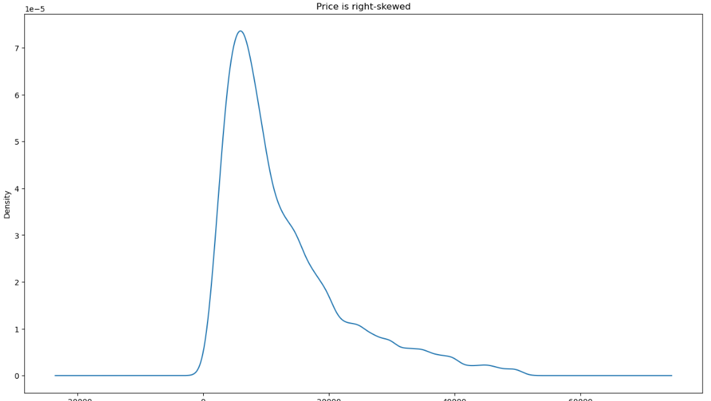
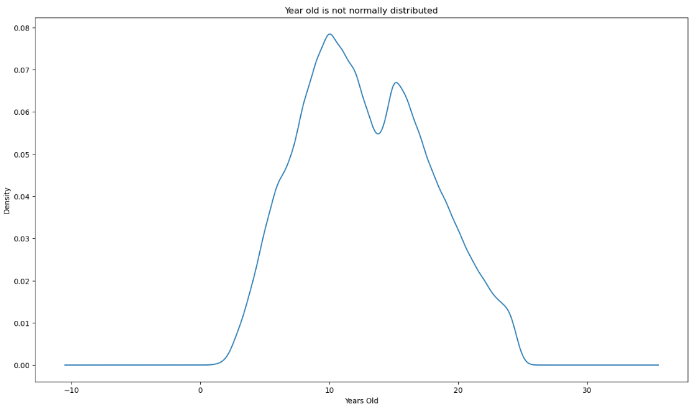
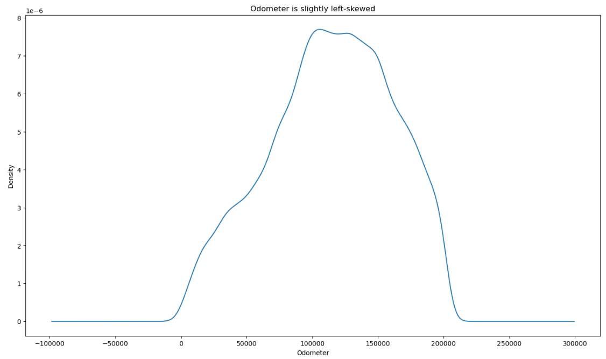
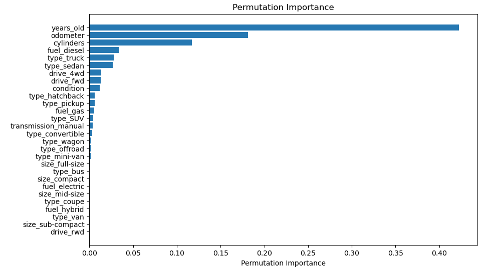
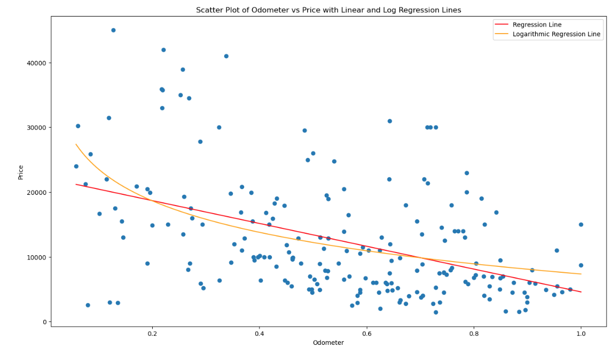
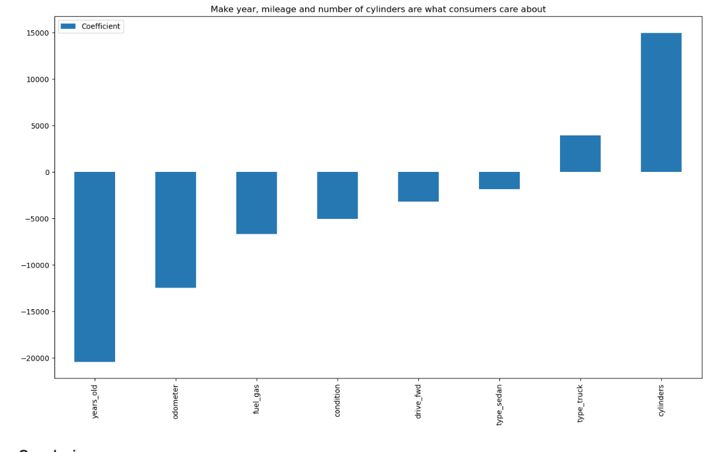

# What drives the price of a car?
Using a dataset of used cars, we will explore the factors that drive the price of a car. We will create a price prediction model and by examining the model's data, we can understand the relationship between the price of a car and its attributes.  Looking at coefficients of the model, we can determine the direction and the strength of car pricing factors.

## Data Description
Data used from this analysis is from Kaggle.  426,000 car records were analyzed.

### Data Used 
- Price: Price of car
- Condition: new, like new, excellent, good, fair or salvage
- Number of cylinders
- Fuel type: gas, diesel, hybrid , or electric           0
- Odometer: mileage of car
- Transmission: automatic  or manual
- Drive: Rear, Front, or All-wheel drive
- Size: full-size, mid-size, compact, sub-compact
- Type: truck, pickup, mini-van, bus, SUV, convertible, sedan, hatchback, wagon, van, offroad, coupe
- Years: Year car was manufactured

### Data Cleaning
- Records with invalid or missing data were removed
- Only records with clean title status were used, as used car dealership would not deal with cars with unclean title status
- Cars with price less than $1000 or more than $50,000 were removed as they are outliers.  Some are invalid data and some are custom or high-end cars that are not typical used cars sold at a dealership
- Cars with odometer reading of less than 1000 were removed as they are likely new cars
- Cars with odometer reading of more than 20000 and older than 25 years were removed as dealerships typically do not sell cars with high mileage or older than 25 years

Remaining number of records: 44,438

### Data Distribution
Range, mean and median of the continuous variables

Price, Odometer, Years Old are not normally distributed

### Feature Selection

#### Permutation Importance
Using linear regression model to run permutation importance analysis, we drop features that have very little impact on price.
)

#### Correlation
Examining the correlation of the features, the following features were dropped
- Fuel type diesel is highly correlated with gas 
- All or 4-wheel drive is correlated with front-wheel drive

Both have negative correlation, meaning these features are opposite and not meaningful to use together. This inidicates that there is limited data for cars that are not gas or diesel and those that are not 4-wheel or front-wheel.  These 2 features are almost binary, so we will drop diesel and 4-wheel drive.

## Model
Since price, odometer, and years old are not normally distributed, we will compare linear regression, Ridge and Lasso model to predict the price of a car.

### Visualization
Scatter plot of price vs odometer of linear and log regression lines are not indicative of the relationship between price and odometer. 

### Model Evaluation
All 3 models yields extremely close results.  The R-squared value is 0.69 for all 3 models.  The root mean squared error is 5382 for all 3. This suggests that the linear regression model is the best model to use for this dataset.

## Conclusion
Ridge and Lasso models yields same performance as linear regression model. This demonstrates a linear relations between the price and the features: years in age, mileage, number of cylinders, fuel type, condition, drive type and whether the car is a sedan or a truck.

While this is not a very strong predictive model, with only 0.69 R-squared, used for predicting car prices, we can deduce from the model that the following are the most important features that consumers care about.

#### These features have major negative impact on price

**Age of car** - This is the driving factor for car price. The older the car is, the cheaper it would be.
Mileage - Odometer reading of the car is the mileage and the higher the readying, the lower the price
These features have some negative impact on price

**Fuel type** - Cars with gas fuel type has a negative coefficient, meaning that electric and hybrid cars are priced higher, but it is correlated with age of car, as electric and hybrid cars tend to be newer
**Condition** - Condition rating is from 0 to 5 where 0 is new and 5 is savage. The worse condition of the cars are the lower the price
**Drive type** - Front-wheel drive cars are lowered price that back-wheel drive
**Sedan** - Very minor impact on cars that are sedans, meaning that trucks and SUVs are higher priced

#### These features have negative impact on price
**Number of cylinders** - Cars with more cylinders are higher priced. This is the number 3 factor in prices
**Truck** - Trucks are higher price than other car types

# Next Steps
Based on this analysis, used car dealership should value cars based on these top 3 criteria
- Year the car is manufactured
- Mileage
- Number of cylinders

For more precise price prediction, we can develop models specific to the make and model of the cars. Car buyers usually have brand-affinity and have a specific car type in mind when purchasing a car. Valuation specific to the brand and model can help used car dealership determine pricing of cars the dealership purchase by subtracting the desire margin from the predicted price.
